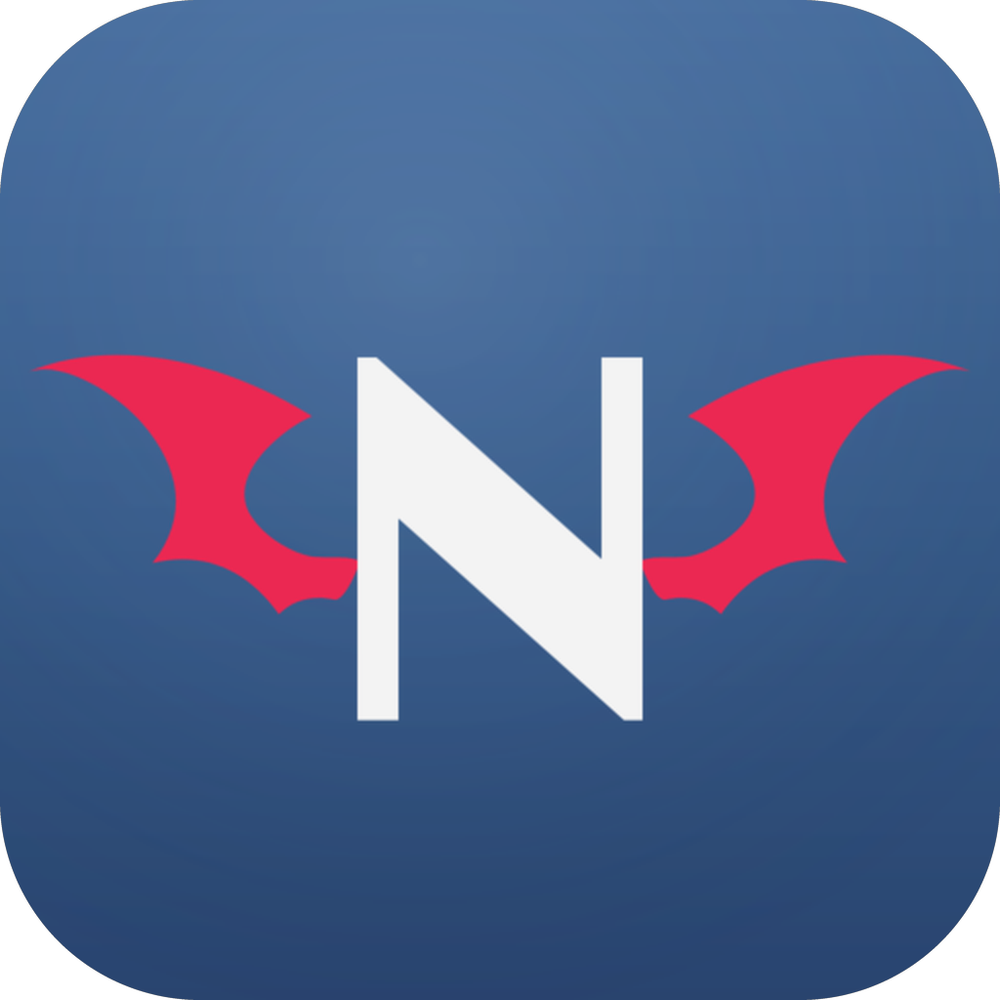

<h1 align="center">
  
   
  NextN
</h1>

原生 HarmonyOS NEXT 的 nhentai（NH）非官方客户端。

## 项目状态

0.1.0 早期版本，功能以实际实现为准。

## 功能

- 浏览：最新、热门、语言筛选、随机画廊
- 搜索：NH 搜索语法、高级搜索条件、最近搜索、标签建议
- 画廊：详情、标签翻译、页面预览、公开评论、相关推荐、分享
- 阅读器：纵向/翻页阅读、缩放、续读、本地缓存
- 下载：下载队列、CBZ/种子文件导出
- 账户：应用内登录、登录状态保持、收藏
- 历史与设置：本地历史、内容过滤、翻译设置

## 系统要求

- HarmonyOS NEXT（API 23 及以上）

## 免责声明

NextN 是独立开发的非官方客户端，与 nhentai 及其运营方没有任何隶属关系；不提供、不托管任何内容，所有内容均来源于 nhentai 网站。

## 文档

- [架构（实现概览）](docs/architecture.md)
- [开发规范（参与开发必读）](docs/developer-guide.md)

## 许可

项目未声明开源许可（UNLICENSED，保留所有权利）；参考来源说明见 [NOTICE.md](NOTICE.md)。
